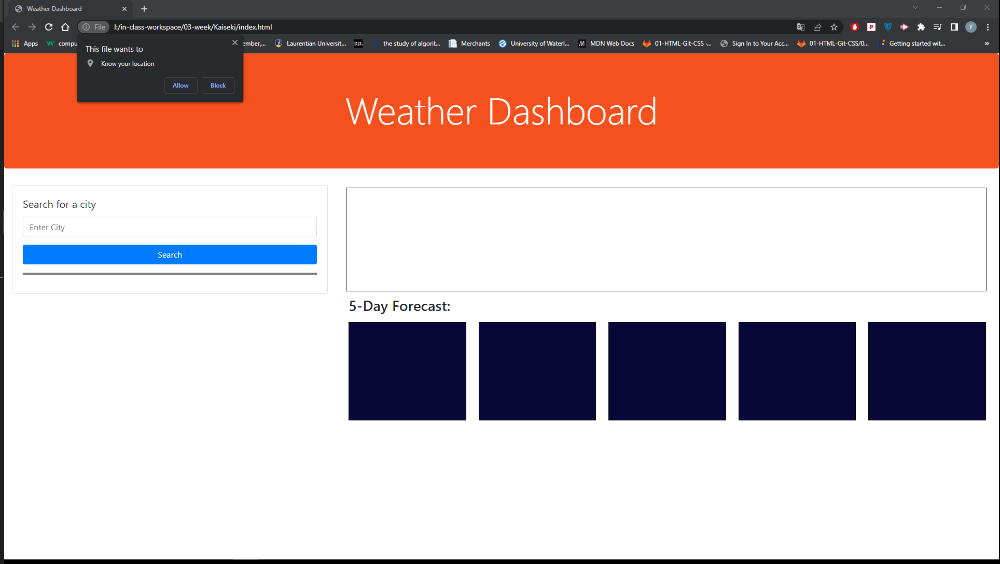
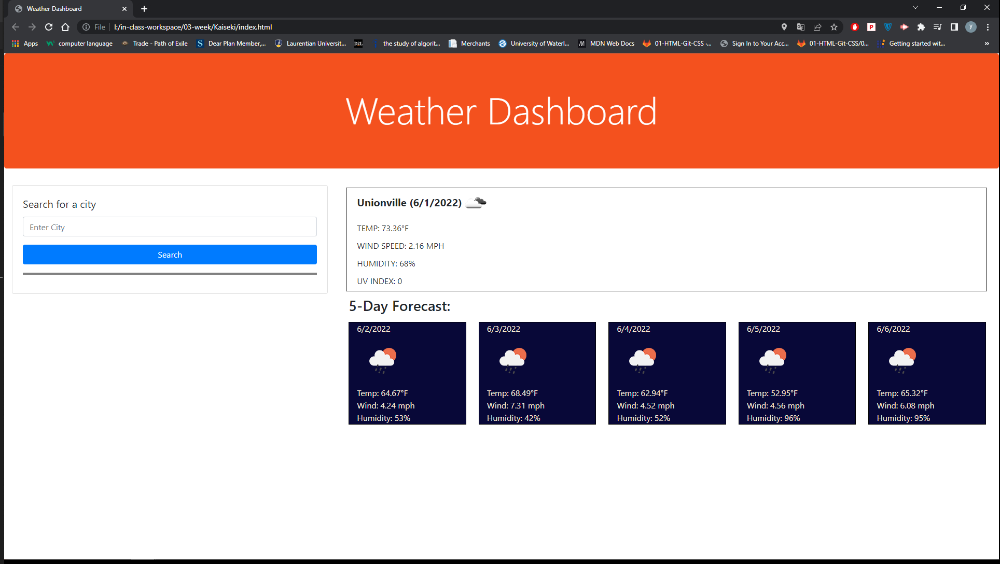
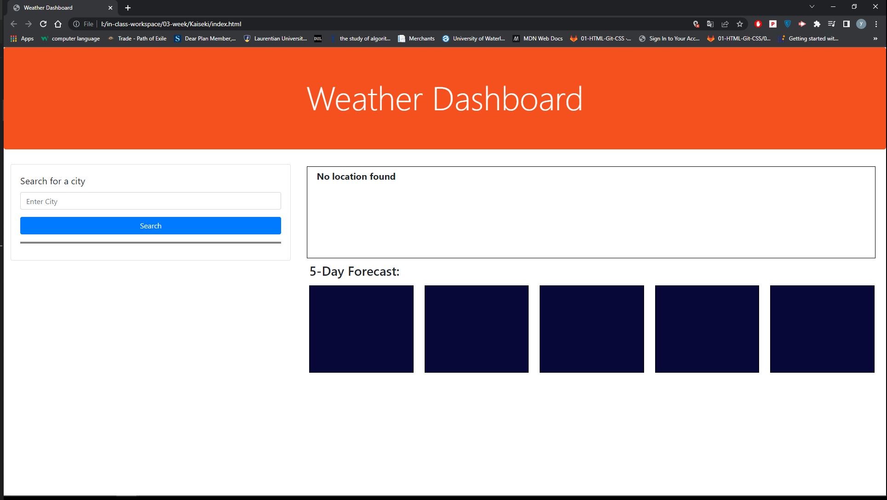
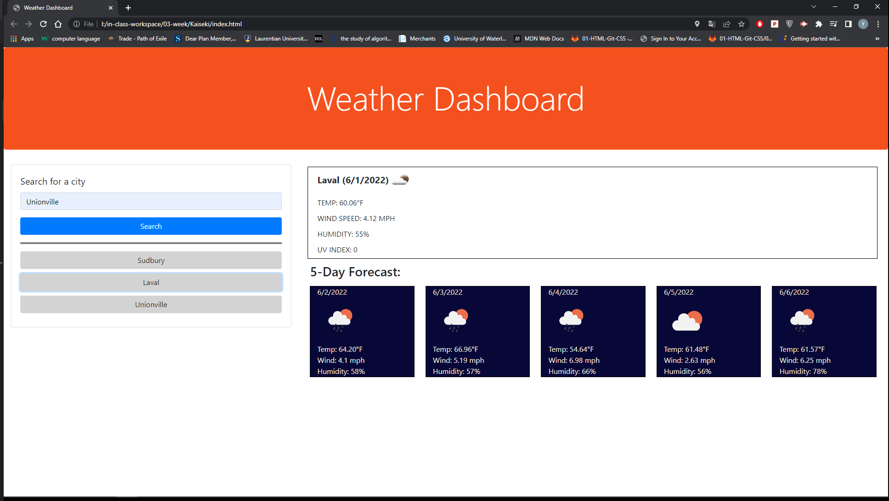

# 06 Server-Side APIs: Weather Dashboard

## Description

This challenge is very interesting for me. I add a geolocation function to this page to get user current location. If user want to take a look at the weather information for current location, it is simple to click allow botton at the beginning. Then page will show weather information. And 5 days forecast.

When user did not enter city name and click search button, an alert will pop up which is used to remind the user to enter a city name.

When user enter a city name and click search button, the current time and 5 days forecast weather information will be showing on the right side. 

Also the search history will be displayed below the search button at the same time. Search history will be saved in the local storage. When user refresh web page, search history will still be there.

Each search history is a button which user can click on it to get the weather information for that city.

https://midnightwxd.github.io/Kaiseki/